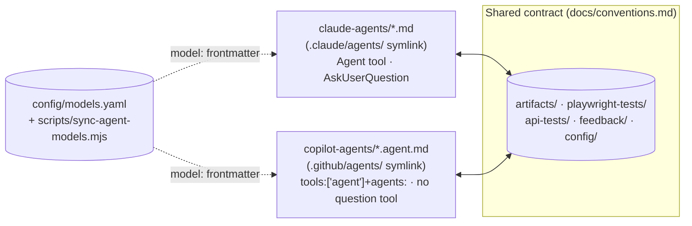
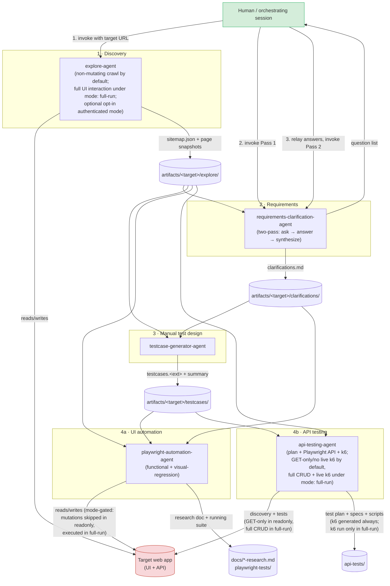
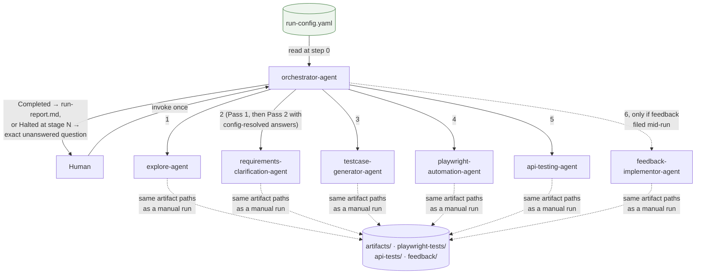
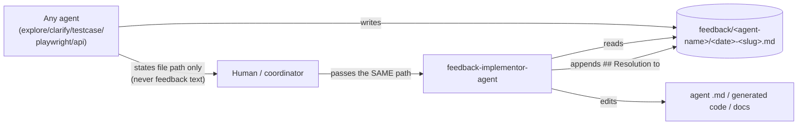

# Architecture

## Design summary

Six single-purpose subagents, each scoped to one stage of the testing lifecycle, connected by **convention** rather than by code: every agent reads and writes fixed, documented file paths (`docs/conventions.md`). A seventh agent, `orchestrator-agent`, is a hub that drives those six in order from a single run-config file — but it is layered *on top of* the same file-based contract, not a different mechanism. Either a human invokes the six spokes directly, or `orchestrator-agent` does, one call at a time, scoped to exactly those six agent types. There is no separate orchestrator *process*, no shared runtime, and no agent-to-agent direct communication outside that one hub relationship — the filesystem is still the integration layer even when the hub is doing the invoking.

This is a deliberate choice, not a gap:
- It keeps each agent's definition small, auditable, and independently testable.
- It keeps a human in the loop at the one point that genuinely needs judgment (requirements clarification) — either directly, or through a run-config file that pre-answers the recurring cases so the orchestrator doesn't need to interrupt for them.
- It means the artifacts are useful even if you only ever run one agent — e.g. you can run `explore-agent` alone just to get a sitemap and screenshots, with nothing downstream required.
- It means the orchestrator adds convenience without adding a second source of truth: it reuses the exact same artifact paths a manual run would, so a run started by hand and finished by the orchestrator (or vice versa) just works.

### Two renderings, one contract

This same seven-persona design is now authored twice — once native to Claude Code, once native to GitHub Copilot — sharing everything above unchanged:



Neither flavor is a copy of the other's file — each is hand-authored for its platform's own tool/frontmatter vocabulary — but both implement the identical seven responsibilities against the identical artifact paths, so a run started in one flavor produces artifacts the other can read. Both flavors drive `explore-agent`'s browser crawl through the same Playwright MCP server, just registered under each platform's own config file (`.mcp.json` for Claude Code, `.vscode/mcp.json` for Copilot) and referenced with each platform's own tool-name syntax (`mcp__playwright__browser_navigate` vs. `playwright/browser_navigate`). See `docs/copilot-setup.md` for what's mechanically different about the Copilot rendering (orchestration mechanism, the missing structured-question tool).

## Component / pipeline diagram



## Sequence view (single dogfood pass)

```mermaid
sequenceDiagram
    participant H as Human
    participant EA as explore-agent
    participant RC as requirements-clarification-agent
    participant TG as testcase-generator-agent
    participant PW as playwright-automation-agent
    participant API as api-testing-agent
    participant FS as artifacts/ (filesystem)

    H->>EA: target URL, mode, maxPages/maxDepth
    EA->>FS: sitemap.json, per-page snapshots, created-entities.json (full-run only)
    Note over EA: stops at login wall by default; mutates only in mode: full-run,<br/>and only deletes entities it created itself

    H->>RC: Pass 1 (sitemap + any docs)
    RC-->>H: tagged question list [Blocking]/[Nice-to-have]
    H->>RC: Pass 2 (Answers: ...)
    RC->>FS: clarifications.md

    H->>TG: clarifications.md + sitemap
    TG->>FS: testcases.<ext> + traceability summary

    H->>PW: testcases + sitemap + clarifications
    PW->>FS: research doc (if greenfield) + scaffolded suite
    PW->>PW: npm install, playwright install, run suite
    PW-->>H: real pass/fail counts

    H->>API: sitemap (network captures) + testcases + mode
    API->>FS: discovered-endpoints.json + api-test-plan.md
    API->>FS: Playwright API specs + k6 scripts
    Note over API: readonly (default): k6 inspect only, GET-only specs.<br/>full-run: full-method specs executed + k6 run against target.
```

## Hub-and-spoke diagram — orchestrated run

`orchestrator-agent` is the hub; the other six are spokes it calls one at a time — via Claude Code's `Agent` tool in `claude-agents/orchestrator-agent.md`, or via `tools: ['agent']` + an `agents:` whitelist in `copilot-agents/orchestrator-agent.agent.md`. Either way it has no structured way to pause for human input mid-run — the run-config file is what lets it resolve most recurring questions without a human touchpoint. Anything the config doesn't cover still halts the run rather than being guessed. The config's `authorizations.mode` (`readonly` default, or `full-run`) is passed straight through to explore-agent, playwright-automation-agent, and api-testing-agent unchanged — the orchestrator never sets or upgrades it itself.



**Resumability, not retries.** Before invoking any spoke, the orchestrator checks whether that stage's conventional output artifact already exists and skips straight past it if so — the artifacts on disk are the checkpoint, so re-invoking after a halt (with an updated config) resumes rather than restarts. It does not automatically retry a *failed* stage (an environmental blocker like a disconnected browser or a rate limit surfaces immediately, per the same "halt and report, don't guess or loop" posture as everything else in this framework).

## Directory architecture

```
agentic-testing-framework/
│
├── AGENTS.md                        # root instructions for GitHub's cloud coding agent
│
├── claude-agents/                   # THE FRAMEWORK, Claude Code flavor — 7 agent definitions
│   ├── orchestrator-agent.md         # the hub — Agent(the other 6), never a script
│   ├── explore-agent.md
│   ├── requirements-clarification-agent.md
│   ├── testcase-generator-agent.md
│   ├── playwright-automation-agent.md
│   ├── api-testing-agent.md
│   └── feedback-implementor-agent.md
├── .claude/agents -> ../claude-agents           # symlink — Claude Code's required discovery path
│
├── copilot-agents/                  # THE FRAMEWORK, GitHub Copilot flavor — same 7 personas
│   ├── orchestrator-agent.agent.md   # the hub — tools:['agent'] + agents: whitelist
│   ├── explore-agent.agent.md        # target: vscode only — needs a live Playwright MCP session
│   ├── requirements-clarification-agent.agent.md
│   ├── testcase-generator-agent.agent.md
│   ├── playwright-automation-agent.agent.md
│   ├── api-testing-agent.agent.md
│   └── feedback-implementor-agent.agent.md
├── .github/agents -> ../copilot-agents          # symlink — VS Code's + cloud coding agent's discovery path
├── .vscode/mcp.json                 # registers the Playwright MCP server explore-agent needs
│
├── config/
│   ├── run-config.example.yaml      # one target + one feature per file; the orchestrator's only input
│   │                                 # (authorizations.mode: readonly|full-run is the master safety switch)
│   └── models.yaml                  # single source of truth for model/provider, per agent, per flavor
│
├── scripts/
│   └── sync-agent-models.mjs        # patches config/models.yaml into both flavors' `model:` frontmatter
│
├── docs/
│   ├── conventions.md               # pipeline order + artifact path + feedback file + run-config contract
│   │                                 # (platform-agnostic — the shared contract both flavors implement)
│   ├── copilot-setup.md             # Copilot-specific setup + what's mechanically different
│   ├── validation-report.md         # evidence the agents work, per-agent feedback
│   └── playwright-framework-research.md   # produced BY playwright-automation-agent (example output)
│
├── artifacts/<target-slug>/         # PIPELINE HANDOFF ZONE — stages 1-3 output, per target
│   ├── explore/{sitemap.json, crawl-log.md, pages/<slug>/*, created-entities.json (full-run only)}
│   ├── clarifications/<feature>-clarifications.md
│   ├── testcases/{<feature>-testcases.<ext>, testcases-summary.md}
│   ├── api/{discovered-endpoints.json, api-test-plan.md, created-entities.json (full-run only)}
│   └── run-report.md                # written by orchestrator-agent, only on an orchestrated run
│                                     # (states the active authorizations.mode up front)
│
├── feedback/<source-agent-name>/<date>-<slug>.md   # FEEDBACK LOOP — one folder per filing agent
│                                                     # (traceable by folder name); each file gets a
│                                                     # ## Resolution section appended in place once
│                                                     # feedback-implementor-agent processes it
│
├── playwright-tests/                 # EXECUTABLE OUTPUT — self-contained, liftable into target repo
└── api-tests/{playwright-api/, k6/}  # EXECUTABLE OUTPUT — self-contained, liftable into target repo
```

## Feedback loop architecture

The five task agents and `feedback-implementor-agent` form a closed loop, kept deliberately out of the linear per-target pipeline (§ diagrams above) since it's invoked ad hoc, not on every run:



The point of passing a **file path** rather than feedback text at every arrow above is to avoid re-transmitting the same content through multiple LLM calls — each hop reads the file once from disk instead of re-generating or re-summarizing it, and the file itself (finding + eventual resolution, in one place) is what makes every piece of feedback traceable back to the agent that raised it and auditable after the fact.

Four tiers, four different lifetimes:
1. **`claude-agents/` / `copilot-agents/`** — the actual product of this repo, in both flavors. Rarely changes; versioned carefully. `config/models.yaml` (model/provider selection) changes somewhat more often but is still a source-of-truth file, not per-engagement data.
2. **`config/`** — one run-config file per target/feature you run repeatedly, worth keeping and refining (each answered question you add is one less halt next time). More stable than `artifacts/`, less stable than the agent definitions.
3. **`artifacts/<target-slug>/`** — throwaway-ish, per-engagement handoff data. One folder per target app.
4. **`playwright-tests/` / `api-tests/`** — real, standalone, deployable test projects, meant to be copied into whatever repo actually owns the target product once they're good enough.

## Safety architecture

Four independent guardrail layers, each enforced at a different point:

| Layer | Mechanism | Where |
|---|---|---|
| **`authorizations.mode`: one master switch, opt-in per target** | A single run-config field, `readonly` (default, used whenever the field is absent) or `full-run`, governs explore-agent, playwright-automation-agent, and api-testing-agent uniformly. `readonly`: no mutating UI clicks/form submissions, API tests stay GET-only, mutating Playwright specs are generated but skipped, k6 is never run live. `full-run`: full UI interaction, full GET/POST/PUT/PATCH/DELETE API coverage, mutating specs execute, and a live `k6 run` is permitted. An agent must see `mode: full-run` explicitly in its own invocation prompt — it is never inferred from a target "looking safe" or from any other instruction. `orchestrator-agent` only ever passes through what the config says; it never sets or escalates the mode itself. | Baked into every executing agent's system prompt + the run-config schema (`docs/conventions.md`) |
| **Self-created-entity scoping for destructive actions — holds in both modes** | Even under `mode: full-run`, a destructive action (delete/cancel/remove) may only target an entity that agent's own run created — each agent tracks what it creates in a `created-entities.json` log and checks against it before deleting anything. Pre-existing data, seed data, and other users' data are never valid delete/cancel targets, at any mode. An irreversible real-world side effect with no test/sandbox path (e.g. capturing a real payment) is skipped with a stated reason rather than completed, regardless of mode. | Agent persona hard rule, not a config parameter |
| **No inline secrets** | Claude Code's own credential-leakage classifier blocks plaintext secrets inside an agent prompt; Copilot has no documented equivalent classifier, so this guardrail leans more heavily on agent design there. Every agent, in both flavors, is designed to read credentials from a `.env`-style file instead of ever expecting them inline. | Platform-enforced (Claude Code) + agent design (both flavors) |
| **Human authorization for exceptions** | Both `authorizations.mode: full-run` and an authenticated crawl (`authorizations.authenticated_crawl` + `credentials_file`) are opt-in fields a human sets explicitly in the run-config for a specific target — never inferred or assumed by an agent. `feedback-implementor-agent` never runs `k6 run` for its own fix-verification purposes regardless of any target's mode; that exception belongs to api-testing-agent's real pipeline run only. | Human-in-the-loop, per invocation |

## Runtime / deployment model

- **No long-running process, orchestrated or not, in either flavor.** Each agent invocation — including `orchestrator-agent`'s own invocations of its six spokes — is a single request/response call. State lives entirely in the filesystem (`artifacts/`, `playwright-tests/`, `api-tests/`, `feedback/`), not in agent memory. The orchestrator doesn't hold a session open across stages any more than a human clicking through them by hand would; it just doesn't need to be re-prompted between clicks.
- **Session-scoped agent registration — doubly true for the orchestrator, in both flavors.** Claude Code loads `.claude/agents/*.md` (symlinked from `claude-agents/`) when a session starts; a file added or edited mid-session is not picked up by that session. VS Code's discovery of `.github/agents/*.agent.md` (symlinked from `copilot-agents/`) may be similarly cached per-session — verify against your VS Code version. Either way, `orchestrator-agent` needs all six spoke types *also* registered before it can natively delegate to them — a fresh session/reload is required for the whole set, not just the orchestrator's own file.
- **The orchestrator cannot escalate to a human mid-run, in either flavor.** Claude Code's `AskUserQuestion` is unavailable to a subagent; Copilot has no such tool at all, for any agent. A run-config file is the only way to pre-resolve what would otherwise be an interactive question; anything left unresolved halts the run rather than the orchestrator finding another channel to ask.
- **Portable by design.** Copying `claude-agents/` (with a `.claude/agents` symlink) and/or `copilot-agents/` (with a `.github/agents` symlink) into any other repo makes the corresponding flavor available there — nothing in this repo is hardcoded to the `eventhub` example target beyond the `artifacts/eventhub/` example data and `config/run-config.example.yaml`'s sample values.
