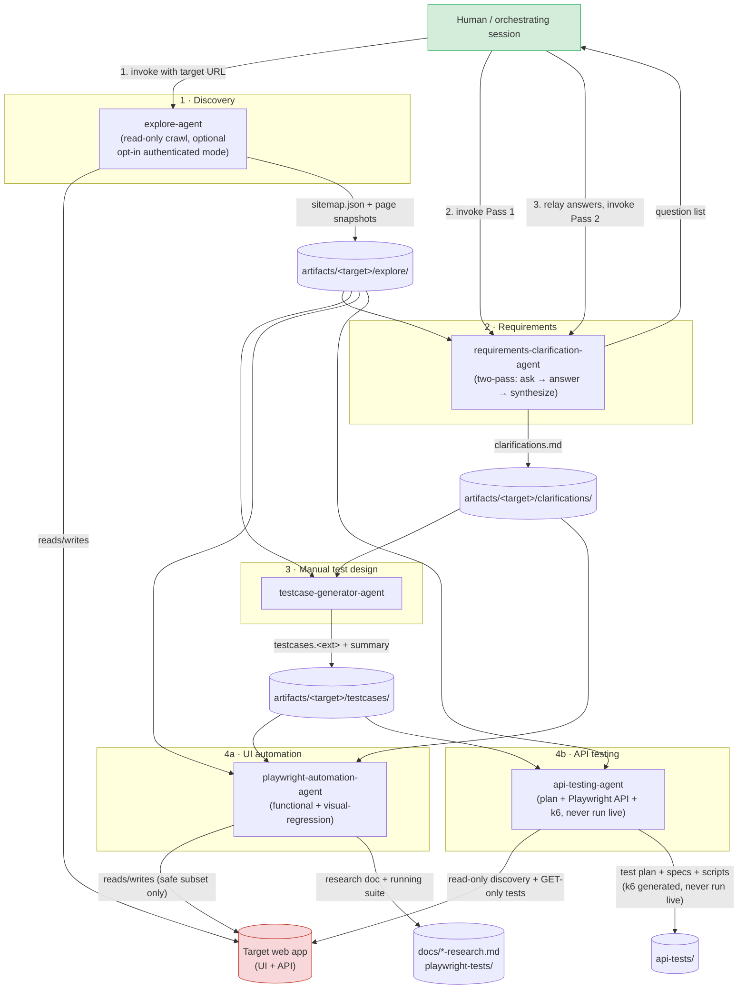
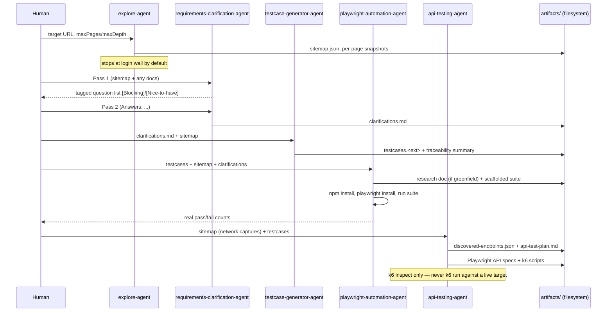

# Architecture

## Design summary

Five single-purpose Claude Code subagents, each scoped to one stage of the testing lifecycle, connected by **convention** rather than by code: every agent reads and writes fixed, documented file paths (`docs/conventions.md`), and a human (or a top-level Claude Code session acting on the human's behalf) invokes them in order. There is no orchestrator process, no shared runtime, and no agent-to-agent direct communication — the filesystem *is* the integration layer.

This is a deliberate choice, not a gap:
- It keeps each agent's definition small, auditable, and independently testable.
- It keeps a human in the loop at the one point that genuinely needs judgment (requirements clarification) without needing to build a bidirectional interactive-subagent protocol.
- It means the artifacts are useful even if you only ever run one agent — e.g. you can run `explore-agent` alone just to get a sitemap and screenshots, with nothing downstream required.

## Component / pipeline diagram



## Sequence view (single dogfood pass)



## Directory architecture

```
agentic-testing-framework/
│
├── .claude/agents/                 # THE FRAMEWORK — 5 subagent definitions
│   ├── explore-agent.md
│   ├── requirements-clarification-agent.md
│   ├── testcase-generator-agent.md
│   ├── playwright-automation-agent.md
│   └── api-testing-agent.md
│
├── docs/
│   ├── conventions.md               # pipeline order + artifact path contract (the "glue")
│   ├── validation-report.md         # evidence the agents work, per-agent feedback
│   └── playwright-framework-research.md   # produced BY playwright-automation-agent (example output)
│
├── artifacts/<target-slug>/         # PIPELINE HANDOFF ZONE — stages 1-3 output, per target
│   ├── explore/{sitemap.json, crawl-log.md, pages/<slug>/*}
│   ├── clarifications/<feature>-clarifications.md
│   ├── testcases/{<feature>-testcases.<ext>, testcases-summary.md}
│   └── api/{discovered-endpoints.json, api-test-plan.md}
│
├── playwright-tests/                 # EXECUTABLE OUTPUT — self-contained, liftable into target repo
└── api-tests/{playwright-api/, k6/}  # EXECUTABLE OUTPUT — self-contained, liftable into target repo
```

Three tiers, three different lifetimes:
1. **`.claude/agents/`** — the actual product of this repo. Rarely changes; versioned carefully.
2. **`artifacts/<target-slug>/`** — throwaway-ish, per-engagement handoff data. One folder per target app.
3. **`playwright-tests/` / `api-tests/`** — real, standalone, deployable test projects, meant to be copied into whatever repo actually owns the target product once they're good enough.

## Safety architecture

Three independent guardrail layers, each enforced at a different point:

| Layer | Mechanism | Where |
|---|---|---|
| **Default read-only** | Agents never click destructive/mutating UI elements or call non-GET APIs against a live target unless a step's own persona explicitly carves out a narrow, justified exception (e.g. one login call to obtain a token). | Baked into every agent's system prompt |
| **No inline secrets** | Claude Code's own credential-leakage classifier blocks plaintext secrets inside an agent prompt. Agents are designed to read credentials from a `.env`-style file instead. | Platform-enforced + agent design |
| **No live load testing** | `api-testing-agent` generates k6 scripts but is hard-instructed to never run `k6 run` against any target; static `k6 inspect`/manual review only. | Agent persona hard rule |
| **Human authorization for exceptions** | Anything beyond the default (authenticated crawling, running a generated k6 script for real, mutating a target) requires an explicit, scoped, human-given instruction — never inferred or assumed by an agent. | Human-in-the-loop, per invocation |

## Runtime / deployment model

- **No long-running orchestrator.** Each agent invocation is a single request/response Task-tool call. State lives entirely in the filesystem (`artifacts/`, `playwright-tests/`, `api-tests/`), not in agent memory.
- **Session-scoped agent registration.** `.claude/agents/*.md` files are loaded when a Claude Code session starts; a file added or edited mid-session is not picked up by that session's Agent tool. A new session is required before a new/changed `subagent_type` is invocable.
- **Portable by design.** Copying the five `.md` files into any other repo's `.claude/agents/` makes the framework available there — nothing in this repo is hardcoded to the `eventhub` example target beyond the `artifacts/eventhub/` example data itself.
