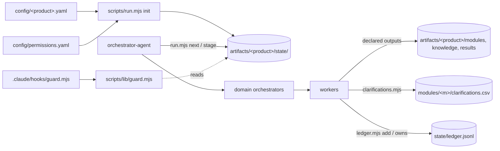

# Architecture

## Design principles

1. **Deterministic work lives in code, judgment lives in agents.** Run state, stage ordering, locks, output verification, the clarifications CSV, the created-entity ledger and permission checks are scripts with tests. Agents explore, reason and generate.
2. **One job per agent.** 43 small agents with declared inputs and outputs, in three layers: the main orchestrator → domain orchestrators → workers (native nested subagents). Workers never spawn and never talk to each other; every hand-off goes through the parent orchestrator as a file. Roster and flow: [`docs/agent-architecture.md`](docs/agent-architecture.md).
3. **Product-level knowledge.** Everything accumulates under `artifacts/<product>/` across runs (knowledge, module exploration, clarifications); per-run outcomes are archived under `results/<run-id>/`. One active run per product. Contract: [`docs/artifact-contract.md`](docs/artifact-contract.md).
4. **Permissions are data, enforced in code.** `config/permissions.yaml` is the ceiling for each agent; the run's `authorizations.mode` caps everyone (readonly ⇒ read-only for all). The guard identifies the calling agent and enforces spawns, shell, HTTP/load, browser and file writes. Deletes are limited to entities the current run created.
5. **Platform-neutral core, thin platform shell.** Only agent definition files and the hook adapter are Claude Code–specific.

## Components

| Layer | Where | Responsibility |
|---|---|---|
| Agents (Claude Code) | `claude-agents/*.md` via `.claude/agents` | the 43 roles in `docs/agent-architecture.md` (being built domain by domain) |
| Contract + state | `scripts/lib/contract.mjs`, `scripts/run.mjs`, `schemas/` | layout, stage table, output verification, lock, history |
| Clarifications | `scripts/lib/clarifications.mjs`, `scripts/clarifications.mjs` | the product-level CSV: ids, de-dup, human-answer preservation |
| Safety | `scripts/lib/{guard,permissions,ledger}.mjs`, `scripts/ledger.mjs`, `.claude/hooks/guard.mjs` | mode cap, per-agent permissions, ledger-scoped deletes |
| Config | `config/run-config.example.yaml`, `config/permissions.yaml`, `config/models.yaml`, `scripts/run-config.mjs` | per-run settings, per-agent ceilings, per-agent models |
| Generated test code | `playwright-tests/<product>/` (tests/ui + tests/api), `k6-tests/<product>/` | written by the Playwright/K6 domains |

## Status

- **Done:** foundation — layout v2, run lifecycle and lock, stage verification, clarifications CSV, ledger, permissions resolution and enforcement, run-config v2 (`npm test`).
- **Next, in order:** knowledge-generator → module-explorer → clarification domain → testcase domain → shared repo owner + Playwright UI → Playwright API → K6 → report.
- **Then:** per-role models in `config/models.yaml` for the 43 agents, CI running `npm run check`.
